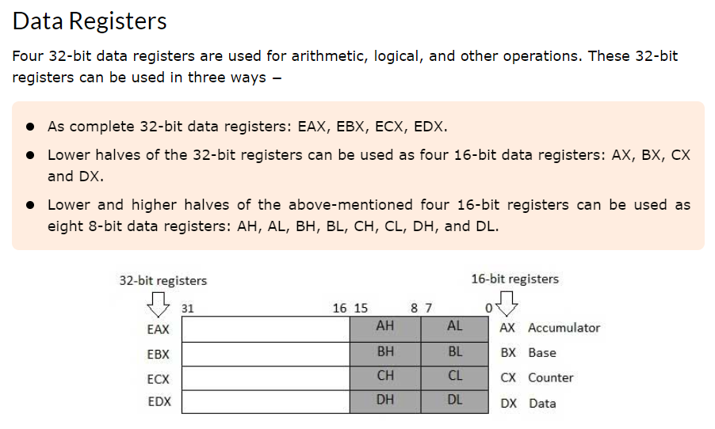

### Ejecutar codigo
**`1`**. ```nasm -f elf32 program.nasm -o program.o```  

**`2`**. ```ld -m elf_i386 -o program program.o```  

**`3`**. ```./program```  


### Definición de Datos

- **`db` (Define Byte)**: Define un valor de 1 byte (8 bits). Se utiliza para enteros sin signo de 8 bits y cadenas de caracteres.

- **`dw` (Define Word)**: Define un valor de 2 bytes (16 bits). Se utiliza para enteros de 16 bits.

- **`dd` (Define Double Word)**: Define un valor de 4 bytes (32 bits). Se usa para enteros de 32 bits y números en punto flotante de precisión simple.

- **`dq` (Define Quad Word)**: Define un valor de 8 bytes (64 bits). Se usa para enteros de 64 bits.


### Instruccion de comparación y saltos. 

- **`cmp`**: Compara dos valores.
  
- **`jg` (Jump Greater)**: Salta a una dirección específica si el primer valor es mayor que el segundo.

- **`je` (Jump Equal)**: Salta a una dirección específica si los dos valores son iguales.

- **`jo` (Jump Overflow)**: Salta a una dirección específica si ocurre un desbordamiento aritmético.

- **`js` (Jump Sign)**: Salta a una dirección específica si el resultado es negativo.

- **`test`**: Verifica el bit de un registro para determinar si el resultado es par o impar (por paridad).

[Link a TutorialsPoint](https://www.tutorialspoint.com/assembly_programming/assembly_registers.htm)

